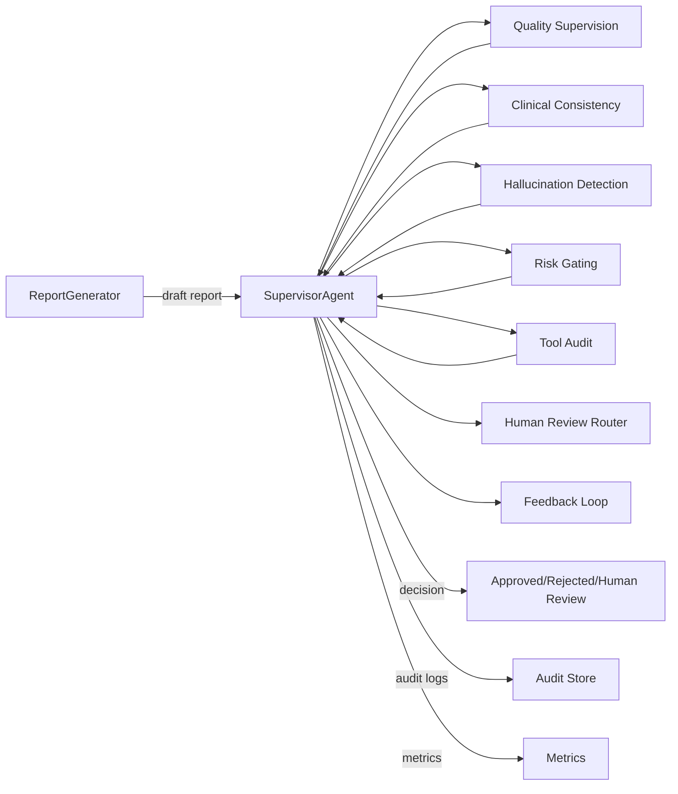

# SupervisorAgent (ReportGenerator Supervisor)

## Purpose
SupervisorAgent is a safety and quality control layer that supervises ReportGenerator outputs in a medical AI system. It enforces report quality, clinical consistency, hallucination detection, risk gating, human review routing, tool execution auditing, and continuous learning feedback using a state machine-driven workflow.

## System Architecture
- Inputs: report draft, structured evidence, tool execution logs, patient context, policy config.
- Core: state machine orchestrator with modular evaluators and gates.
- Outputs: decision (approve/reject/escalate), issues list, audit trail, feedback payload.

### Key Design Goals
- Deterministic state progression with explicit transition criteria.
- Traceable decisions with evidence-linked issues.
- Configurable thresholds and policy rules.
- Safe-by-default escalation on uncertainty.

## Module Decomposition
1. Orchestrator
   - StateMachineEngine
   - TransitionPolicy
2. Quality Supervision
   - QualityScorer
   - StyleAndCompletenessChecker
3. Clinical Consistency
   - ClinicalConsistencyChecker
   - TerminologyNormalizer
   - GuidelineValidator
4. Hallucination Detection
   - EvidenceLinker
   - FactChecker
   - UnsupportedClaimDetector
5. Risk Gating
   - RiskAssessor
   - SafetyPolicyGate
6. Hard Case Routing
  - HardCaseRouter
7. Human Review Routing
   - HumanReviewRouter
   - ReviewQueueClient
8. Tool Execution Audit
   - ToolAuditCollector
   - ToolAuditAnalyzer
9. Continuous Learning
   - FeedbackCollector
   - LabelingExporter
10. Feedback Memory
   - FeedbackMemory
   - JsonlFeedbackMemory
11. Self-Evolution
   - SelfEvolutionEngine
12. Persistence and Observability
   - DecisionStore
   - AuditLogStore
   - MetricsEmitter

## Rule Layer (Deterministic Checks)
- RuleEngine executes deterministic checks before any LLM usage.
- Rule categories: quality/completeness, clinical consistency, hallucination, risk, audit completeness.
- Rules are driven by PolicyConfig (min length, required sections, required patient fields, evidence required, risk keywords).
- LLM is optional and should be invoked only after rule layer passes or for tie-breaks.

## ReportAgent Interface Alignment
- 对齐 ReportData 与 GenerateReportDraftResponseSchema。
- 关键字段映射：
  - findings, conclusion, layoutSuggestion
  - tool_calls -> tool_logs
  - report_score, react_analysis, react_refinement
  - workflow (AgentWorkflowSchema) -> report_workflow
- 提供适配器 build_context_from_report_agent()，可直接从 ReportAgent 输出构建 SupervisorContext。

```python
from supervisor_agent import build_context_from_report_agent, build_default_agent

context = build_context_from_report_agent(
    report_payload=report_dict,
    workflow_payload=workflow_dict,
    tool_logs=report_dict.get("tool_calls", []),
    patient_context=patient_context,
    report_id=report_id,
)

decision = build_default_agent().evaluate(context)
```

## Default Rule-Based Implementation
- rules.py defines Rule, RuleResult, and RuleEngine.
- rule_based.py provides RuleBased* components and RuleBasedStateMachineEngine.
- build_default_agent() assembles a rule-only SupervisorAgent.

## Data Flow
1. Ingest draft + evidence + tool logs + patient context.
2. Normalize terminology and structure.
3. Execute rule-based quality and completeness checks.
4. Validate clinical consistency against guidelines and evidence.
5. Detect hallucinations and unsupported claims.
6. Assess risk and apply gating policy.
7. Decide: approve, reject, or route to human review.
8. Emit audit logs, metrics, and feedback payload.

## State Machine
### States
- INIT
- INGEST
- QUALITY_CHECK
- CLINICAL_CONSISTENCY
- HALLUCINATION_CHECK
- RISK_GATING
- HUMAN_REVIEW
- APPROVED
- REJECTED
- FAILED
- FEEDBACK

### Transition Rules (example)
- INIT -> INGEST on new request.
- INGEST -> QUALITY_CHECK if schema valid.
- QUALITY_CHECK -> CLINICAL_CONSISTENCY if score >= threshold.
- QUALITY_CHECK -> HUMAN_REVIEW if score borderline.
- CLINICAL_CONSISTENCY -> HALLUCINATION_CHECK if no critical mismatches.
- HALLUCINATION_CHECK -> RISK_GATING if unsupported claims <= limit.
- RISK_GATING -> APPROVED if risk <= low threshold.
- RISK_GATING -> HUMAN_REVIEW if risk is medium or uncertainty high.
- Any state -> FAILED on tool/system failure with safe fallback.
- APPROVED/REJECTED/HUMAN_REVIEW -> FEEDBACK after decision captured.

## Schema Design
### Core Objects
- Report: findings, conclusion, layout_suggestion, tool_calls, report_score, react_analysis, react_refinement.
- Evidence: source, citation, extracted facts.
- Issue: type, severity, location, evidence_refs.
- Decision: status, rationale, risk_level, issues.
- AuditRecord: tool logs and audit metadata.
- Feedback: labels, reviewer_notes, corrections.
- ReportWorkflow: workflow summary aligned to AgentWorkflowSchema.

### JSON Schema (Draft 2020-12)
```json
{
  "$schema": "https://json-schema.org/draft/2020-12/schema",
  "$id": "https://example.org/supervisor/decision.schema.json",
  "title": "SupervisorDecision",
  "type": "object",
  "required": ["report_id", "status", "risk_level", "issues", "audit_id"],
  "properties": {
    "report_id": { "type": "string" },
    "status": { "type": "string", "enum": ["approved", "rejected", "human_review", "failed"] },
    "risk_level": { "type": "string", "enum": ["low", "medium", "high", "critical"] },
    "issues": {
      "type": "array",
      "items": {
        "type": "object",
        "required": ["type", "severity", "message"],
        "properties": {
          "type": { "type": "string" },
          "severity": { "type": "string", "enum": ["info", "warn", "error", "critical"] },
          "message": { "type": "string" },
          "location": { "type": "string" },
          "evidence_refs": { "type": "array", "items": { "type": "string" } }
        }
      }
    },
    "audit_id": { "type": "string" },
    "rationale": { "type": "string" },
    "hard_case": { "type": "boolean" },
    "routing": { "type": "array", "items": { "type": "string" } },
    "metadata": { "type": "object" },
    "created_at": { "type": "string", "format": "date-time" }
  }
}
```

## Tool Interfaces
SupervisorAgent depends on tool endpoints for evidence retrieval, guideline validation, and audits.

### Tool Contract (generic)
- request_id: string
- payload: object
- timeout_ms: integer
- response: { ok: boolean, data: object, error: string }

### Tools
1. clinical_knowledge_retriever
   - input: { query, patient_context }
   - output: { evidence_items[] }
2. guideline_validator
   - input: { report_sections, guidelines_version }
   - output: { mismatches[] }
3. terminology_mapper
   - input: { text }
   - output: { normalized_text, term_map }
4. evidence_linker
   - input: { report, evidence_items }
   - output: { claim_links[] }
5. fact_checker
   - input: { claims[], evidence_items[] }
   - output: { unsupported_claims[] }
6. tool_audit_logger
   - input: { tool_name, inputs_hash, outputs_hash, duration_ms }
   - output: { audit_id }
7. human_review_queue
   - input: { report_id, issues, risk_level }
   - output: { ticket_id }

## Hard Case Routing
- 基于风险等级、严重问题、工具错误率、关键词触发人工复核。
- HardCaseRouter 在 RISK_GATING 阶段拦截本应通过的报告。

## Feedback Memory
- 记录决策、问题列表、人工反馈与路由结果。
- 支持内存与 JSONL 持久化实现，供后续分析与回溯。

## Self-Evolution
- 基于反馈统计输出 Policy 更新建议（不自动覆盖）。
- 产出 EvolutionPlan，支持人工审批后更新规则阈值。

## Error Handling
- ValidationError: malformed schema or missing fields -> reject or human review.
- ToolTimeout: retry with backoff; if still failing -> fail-safe human review.
- InconsistencyError: conflicting evidence -> mark critical and reject/escalate.
- AuditFailure: allow decision but flag and require follow-up.
- UnknownError: move to FAILED with full audit context.

## Extensibility Design
- Pluggable checks via registry: add new validators without changing orchestrator.
- Policy-as-config: thresholds and rules in versioned config.
- Evidence adapters: support multiple knowledge sources.
- Model abstraction: swap LLMs or rule engines behind interfaces.
- Event bus: emit decision events for downstream analytics.

---

# Python Class Structure
```python
from __future__ import annotations
from dataclasses import dataclass
from enum import Enum
from typing import List, Optional

class DecisionStatus(str, Enum):
    APPROVED = "approved"
    REJECTED = "rejected"
    HUMAN_REVIEW = "human_review"
    FAILED = "failed"

class RiskLevel(str, Enum):
    LOW = "low"
    MEDIUM = "medium"
    HIGH = "high"
    CRITICAL = "critical"

@dataclass
class Issue:
    type: str
    severity: str
    message: str
    location: Optional[str] = None
    evidence_refs: Optional[List[str]] = None

@dataclass
class Decision:
    report_id: str
    status: DecisionStatus
    risk_level: RiskLevel
    issues: List[Issue]
    audit_id: str
    rationale: Optional[str] = None

class StateMachineEngine:
    def run(self, context: "SupervisorContext") -> Decision:
        raise NotImplementedError

class QualityScorer:
    def score(self, context: "SupervisorContext") -> float:
        raise NotImplementedError

class ClinicalConsistencyChecker:
    def validate(self, context: "SupervisorContext") -> List[Issue]:
        raise NotImplementedError

class HallucinationDetector:
    def detect(self, context: "SupervisorContext") -> List[Issue]:
        raise NotImplementedError

class RiskAssessor:
    def assess(self, context: "SupervisorContext") -> RiskLevel:
        raise NotImplementedError

class HumanReviewRouter:
    def route(self, decision: Decision) -> str:
        raise NotImplementedError

class ToolAuditCollector:
    def record(self, tool_name: str, inputs_hash: str, outputs_hash: str, duration_ms: int) -> str:
        raise NotImplementedError

@dataclass
class SupervisorContext:
    report_id: str
    report_text: str
    evidence: dict
    tool_logs: list
    patient_context: dict
```

# Mermaid Architecture Diagram


# API Schema (OpenAPI 3.1 Snippet)
```yaml
openapi: 3.1.0
info:
  title: SupervisorAgent API
  version: 1.0.0
paths:
  /supervisor/evaluate:
    post:
      summary: Evaluate a report draft
      requestBody:
        required: true
        content:
          application/json:
            schema:
              $ref: '#/components/schemas/EvaluationRequest'
      responses:
        '200':
          description: Decision result
          content:
            application/json:
              schema:
                $ref: '#/components/schemas/Decision'
  /supervisor/status/{report_id}:
    get:
      summary: Get evaluation status
      parameters:
        - name: report_id
          in: path
          required: true
          schema: { type: string }
      responses:
        '200':
          description: Status
          content:
            application/json:
              schema:
                $ref: '#/components/schemas/Status'
  /supervisor/feedback:
    post:
      summary: Submit reviewer feedback
      requestBody:
        required: true
        content:
          application/json:
            schema:
              $ref: '#/components/schemas/Feedback'
      responses:
        '200':
          description: Accepted
components:
  schemas:
    EvaluationRequest:
      type: object
      required: [report_id, report_text, evidence, tool_logs]
      properties:
        report_id: { type: string }
        report_text: { type: string }
        evidence: { type: object }
        tool_logs: { type: array, items: { type: object } }
        patient_context: { type: object }
    Decision:
      type: object
      required: [report_id, status, risk_level, issues, audit_id]
      properties:
        report_id: { type: string }
        status: { type: string }
        risk_level: { type: string }
        issues: { type: array, items: { type: object } }
        audit_id: { type: string }
        rationale: { type: string }
    Status:
      type: object
      required: [report_id, state]
      properties:
        report_id: { type: string }
        state: { type: string }
    Feedback:
      type: object
      required: [report_id, labels]
      properties:
        report_id: { type: string }
        labels: { type: array, items: { type: string } }
        reviewer_notes: { type: string }
```

# Workflow Pseudocode
```text
function supervise(report):
  ctx = build_context(report)
  state = INIT

  while state not in {APPROVED, REJECTED, FAILED}:
    state = next_state(state, ctx)

    if state == QUALITY_CHECK:
      score = quality_scorer.score(ctx)
      if score < policy.min_quality:
        return reject("low quality")

    if state == CLINICAL_CONSISTENCY:
      issues = clinical_checker.validate(ctx)
      if has_critical(issues):
        return escalate_or_reject(issues)

    if state == HALLUCINATION_CHECK:
      issues = hallucination_detector.detect(ctx)
      if too_many_unsupported(issues):
        return escalate_or_reject(issues)

    if state == RISK_GATING:
      risk = risk_assessor.assess(ctx)
      if risk == HIGH or risk == CRITICAL:
        return human_review(risk)

  return approve()
```
