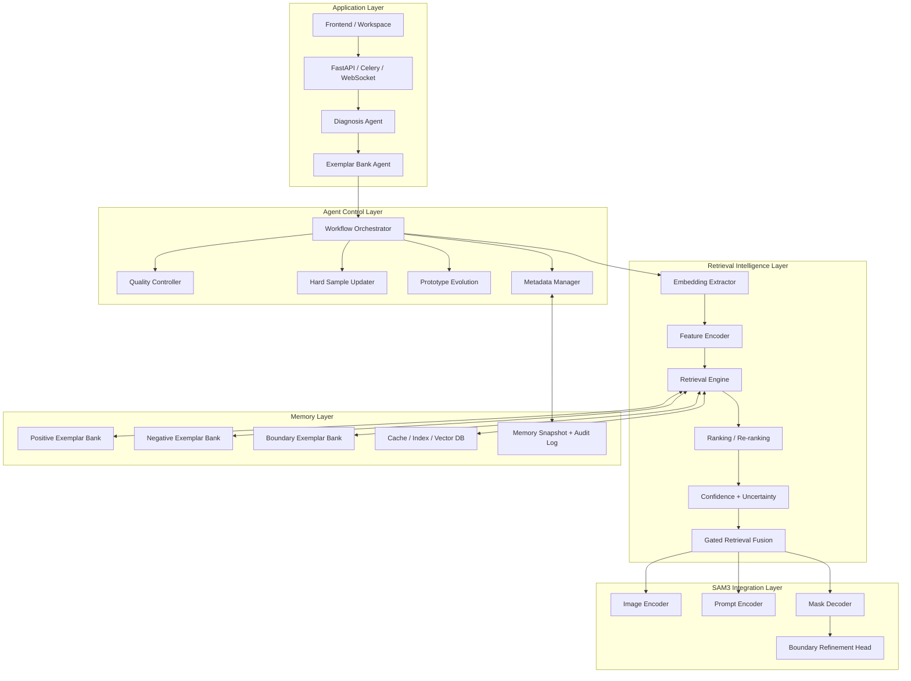
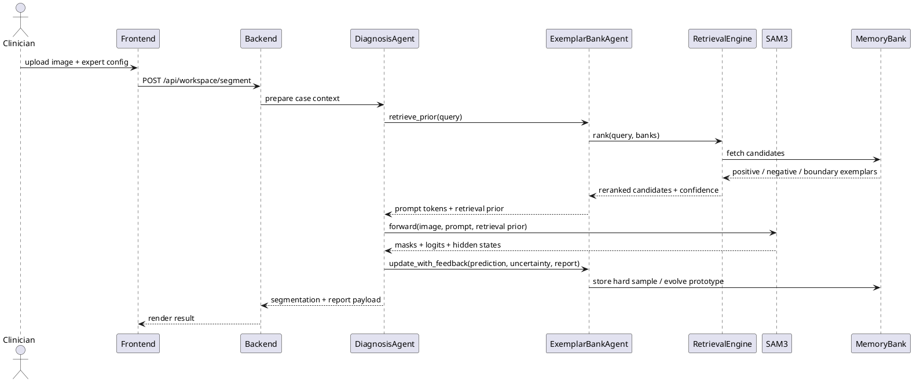
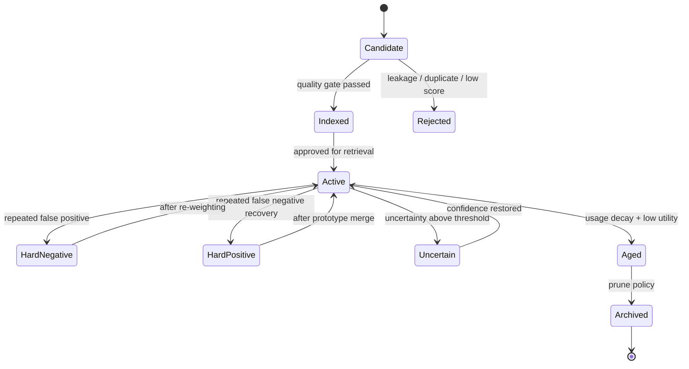

# Exemplar Bank Agent Architecture

## Scope

This document specifies a research-grade and production-oriented `Exemplar Bank Agent` for the SAM3-based medical segmentation stack in this repository.

The agent is designed to:

- manage positive, negative, and boundary exemplar memories
- provide retrieval priors to SAM3 prompt/image/decoder paths
- mine hard samples and retrieval failures
- evolve prototypes under continual learning constraints
- expose an agent-friendly orchestration contract for backend, worker, and future UI integrations

## Assumptions

- SAM3 backbone, LoRA, Prompt Adapter, and retrieval-enhanced segmentation already exist
- segmentation-time retrieval should remain optional and non-destructive to the base visual path
- bank state must support offline curation and online adaptive updates
- external vector stores are pluggable; local JSON + tensor artifacts remain the portable baseline

## Layered Architecture



## Workflow

```mermaid
flowchart LR
    A["Upload image + mask + expert config"] --> B["Extract query semantic/spatial/boundary features"]
    B --> C["Search positive, negative, boundary banks"]
    C --> D["Cross-attention reranking"]
    D --> E["Estimate retrieval confidence + uncertainty"]
    E --> F["Build retrieval prior + exemplar prompt tokens"]
    F --> G["Inject into SAM3 prompt/image/decoder"]
    G --> H["Run segmentation + boundary refinement"]
    H --> I["Collect prediction quality and failure signals"]
    I --> J["Hard sample mining + memory update"]
    J --> K["Prototype evolution / aging / pruning"]
    K --> L["Persist snapshot, cache, audit log"]
```



## Sequence Diagram



## State Flow



## Module Responsibilities

| Module | Responsibility | Input | Output | Communication |
|---|---|---|---|---|
| `MemoryManager` | CRUD, versioning, snapshot persistence, audit trail | exemplar record, update event | snapshot, active index | JSON/tensor files, Redis metadata |
| `EmbeddingExtractor` | derive semantic/spatial/boundary embeddings | image, mask, SAM3 features | embedding bundle | in-process tensor |
| `FeatureEncoder` | align query and bank features to shared hidden space | embeddings, morphology metadata | normalized feature tensors | in-process tensor |
| `PositiveBank` | positive prototype memory | verified positive exemplars | candidate positives | vector search |
| `NegativeBank` | false-positive suppressor memory | negative exemplars | candidate negatives | vector search |
| `BoundaryBank` | boundary refinement priors | boundary exemplars | boundary priors | vector search |
| `RetrievalEngine` | ANN search, dual-bank retrieval, multi-scale aggregation | query features | candidate sets | FAISS / Milvus / Chroma |
| `RankingModule` | cross-attention reranking and fusion weighting | query + candidates | sorted candidates, weights | in-process tensor |
| `CacheIndexSystem` | hot query cache, inverted tags, bank stats | request fingerprint | cache hit / miss | Redis / local cache |
| `HardSampleUpdater` | false positive / false negative / uncertainty mining | prediction outcome | hard sample events | event bus |
| `PrototypeEvolution` | EMA, momentum, clustering, pruning | active prototypes + events | evolved prototypes | async worker |
| `QualityController` | gating, dedup, retention, aging | exemplar metrics | keep/drop/decay decision | in-process + async |
| `MetadataManager` | domain source, tags, retrieval stats, lineage | exemplar event | metadata patch | JSON / DB |

## Data Flow

1. Query image and mask generate SAM3-aligned hidden states.
2. `EmbeddingExtractor` derives:
   - semantic embedding from pooled image/token memory
   - spatial embedding from dense feature maps
   - boundary embedding from boundary band pooling
3. `RetrievalEngine` searches positive, negative, and boundary banks independently.
4. `RankingModule` performs cross-attention reranking and score calibration.
5. `GatedRetrievalFusion` builds:
   - exemplar prompt tokens for prompt encoder
   - encoder memory bias for image encoder hidden states
   - decoder feature bias / mask logit bias
6. SAM3 produces segmentation, which is scored by `QualityController`.
7. `HardSampleUpdater` emits memory events.
8. `PrototypeEvolution` updates centroids, ages stale records, and archives weak samples.

## Input / Output Contracts

### Query Input

```python
{
  "case_id": "case-001",
  "image": "Tensor[B,3,H,W]",
  "mask": "Tensor[B,1,H,W] | None",
  "sam_hidden": "Tensor[B,N,C]",
  "expert_tags": ["0-IIb", "adenoma", "flat"],
  "domain_source": "kvasir",
  "uncertainty_hint": 0.18,
}
```

### Retrieval Output

```python
{
  "prompt_tokens": "Tensor[B,K,C]",
  "retrieval_prior": {
    "semantic_prototype": "Tensor[B,C]",
    "semantic_prototype_map": "Tensor[B,C,Hf,Wf]",
    "spatial_bias_map": "Tensor[B,1,Hf,Wf]",
    "decoder_feature_bias_map": "Tensor[B,C,Hf,Wf]",
    "mask_logit_bias_map": "Tensor[B,1,Hm,Wm]",
    "fusion_alpha": "Tensor[B,1]",
    "negative_lambda": "Tensor[B,1]",
  },
  "confidence": "Tensor[B,1]",
  "uncertainty": "Tensor[B,1]",
  "selected_exemplar_ids": ["..."],
}
```

## Retrieval-Augmented Segmentation Pipeline

### Feature Sources

- semantic feature: pooled `image_embeddings` or encoder memory `[B, N, C] -> [B, C]`
- spatial feature: dense feature map `[B, C, Hf, Wf]`
- boundary feature: boundary band pooling over dense feature map `[B, C]`
- morphology feature: expert / rule-based tags projected to `[B, C]`

### Alignment with SAM3 Hidden States

- query token dimension is aligned to SAM3 hidden dim `C = 256` or `C = 512`
- prompt tokens are projected to `prompt_encoder.exemplar_projection`
- encoder priors operate on `encoder_hidden_states`
- decoder priors inject into `decoder_feature_bias_map` and `mask_logit_bias_map`

### Canonical Shapes

| Tensor | Shape |
|---|---|
| `image_embeddings` | `[B, C, Hf, Wf]` |
| `encoder_hidden_states` | `[B, N, C]` or `[N, B, C]` |
| `query_semantic` | `[B, C]` |
| `query_spatial` | `[B, C, Hf, Wf]` |
| `query_boundary` | `[B, C]` |
| `positive_bank` | `[Bp, C]` |
| `negative_bank` | `[Bn, C]` |
| `boundary_bank` | `[Bb, C]` |
| `prompt_tokens` | `[B, K, C]` |
| `mask_logit_bias_map` | `[B, 1, Hm, Wm]` |

### Retrieval Pseudocode

```python
query = encoder.extract_query(case)
positive = retriever.search(query.semantic, bank="positive", top_k=Kp)
negative = retriever.search(query.semantic, bank="negative", top_k=Kn)
boundary = retriever.search(query.boundary, bank="boundary", top_k=Kb)

reranked = reranker(
    query_tokens=query.tokens,
    positive_tokens=positive.tokens,
    negative_tokens=negative.tokens,
    boundary_tokens=boundary.tokens,
)

prior = fusion(
    semantic_proto=reranked.positive_proto,
    negative_proto=reranked.negative_proto,
    boundary_proto=reranked.boundary_proto,
    spatial_map=query.spatial,
    confidence=reranked.confidence,
    uncertainty=reranked.uncertainty,
)

outputs = sam3_wrapper(
    image=case.image,
    boxes=case.boxes,
    exemplar_prompt_tokens=prior.prompt_tokens,
    retrieval_prior=prior.retrieval_prior,
)
```

## Prototype Evolution

### Hard Sample Memories

- `false_positive_memory`: query retrieved strong positives but prediction was wrong
- `false_negative_memory`: retrieval failed to recall lesion-supportive prototypes
- `uncertainty_memory`: low-confidence segmentation with unstable retrieval support
- `boundary_failure_memory`: good region retrieval but poor contour precision

### Evolution Rules

- EMA centroid update:
  `p_t = m * p_(t-1) + (1 - m) * x_t`
- momentum confidence update:
  `q_t = beta * q_(t-1) + (1 - beta) * score_t`
- curriculum retrieval:
  low-difficulty prototypes are used first for early training / low-confidence cases
- aging:
  utility decay by inactivity and repeated low contribution

### Prototype Quality Score

`Q = 0.22 * clinical_quality + 0.18 * boundary_quality + 0.16 * novelty + 0.12 * hard_value + 0.10 * uncertainty_resolution + 0.10 * retrieval_success + 0.07 * usage_efficiency + 0.05 * freshness`

Retention decisions:

- `Q >= 0.75`: keep and upweight
- `0.55 <= Q < 0.75`: keep with neutral weight
- `0.35 <= Q < 0.55`: decay and mark for review
- `Q < 0.35`: archive / prune

## Exemplar-Guided SAM3

### Injection Points

- prompt encoder:
  - `exemplar_prompt_tokens`
  - semantic prototype residual
- image encoder:
  - encoder memory bias
  - spatial bias map
- mask decoder:
  - decoder feature bias
  - logit bias map
- boundary refinement head:
  - boundary prototype residual and contour-complexity prior

### Anti-Pollution Strategy

- gated fusion:
  `fused = visual + alpha * retrieval_residual`
- uncertainty-aware suppression:
  if retrieval uncertainty is high, reduce `alpha`
- negative prototype inhibition:
  subtract negative residual from decoder logits
- residual-only injection:
  retrieval never replaces raw visual path, it only adds bounded residuals

## Engineering Directory Plan

```text
agent/
  EXEMPLAR_BANK_AGENT_ARCHITECTURE.md
  agents/
    exemplar_bank_agent.py
  tools/
    medical/
      exemplar_bank_schemas.py
      exemplar_bank_memory.py
      exemplar_bank_quality.py
      exemplar_bank_retrieval.py
  test_exemplar_bank_agent.py
Backend/
  app/
    api/endpoints/exemplar_bank.py
    schemas/exemplar_bank.py
    services/exemplar_bank_runtime_service.py
```

## Suggested API

### FastAPI

- `POST /api/exemplar-bank/ingest`
- `POST /api/exemplar-bank/retrieve-prior`
- `POST /api/exemplar-bank/update-feedback`
- `GET /api/exemplar-bank/{bank_id}/stats`
- `POST /api/exemplar-bank/{bank_id}/compact`

### Agent Messaging

```json
{
  "event": "retrieval_feedback",
  "case_id": "case-001",
  "sample_ids": ["ex-1", "ex-8"],
  "dice": 0.84,
  "boundary_f1": 0.72,
  "uncertainty": 0.19,
  "failure_mode": "false_negative"
}
```

## Async / Infra Plan

- Redis:
  - hot query cache
  - retrieval session cache
  - pub/sub for bank update notifications
- Kafka:
  - event sourcing for ingest, prune, evolve, hard sample alerts
- WebSocket:
  - live bank update feed to frontend / operator console
- Worker queues:
  - `bank.ingest`
  - `bank.embed`
  - `bank.reindex`
  - `bank.evolve`
  - `bank.archive`

## GPU / Scale Strategy

- mixed precision for retrieval encoders and rerankers
- ANN search on CPU, fusion on GPU
- pin positive/negative centroids in GPU cache, stream long-tail features on demand
- shard vector DB by domain source / polarity
- use DDP-safe periodic prototype snapshots

## Research Packaging

### Paper Titles

- `Exemplar Bank Agent for Retrieval-Augmented Medical SAM3 Segmentation`
- `Positive-Negative Prototype Memory for Uncertainty-Aware Endoscopic Polyp Segmentation`

### Method Sections

1. Medical exemplar memory formulation
2. Dual-bank retrieval with uncertainty-aware reranking
3. Retrieval-guided prompt / encoder / decoder fusion
4. Dynamic prototype evolution under continual learning
5. Boundary-aware prototype memory

### Ablations

- no retrieval
- positive-only retrieval
- positive + negative retrieval
- no boundary bank
- no uncertainty gate
- no EMA evolution
- no hard sample memory

### Benchmarks

- Kvasir-SEG
- CVC-ClinicDB
- ETIS
- EndoCV
- PolypGen external protocol with strict leakage checks

### Visualizations

- retrieved exemplar panels
- similarity heatmaps
- retrieval confidence vs. segmentation IoU plots
- prototype aging timelines
- failure-mode Sankey diagrams

### Reviewer Concerns and Rebuttals

- leakage concern:
  strict train/external bank isolation and audit logs
- retrieval cost:
  cached ANN + bounded top-k reranking
- prototype drift:
  EMA + aging + archive safeguards
- novelty inflation:
  quality score combines novelty with clinical and boundary usefulness
